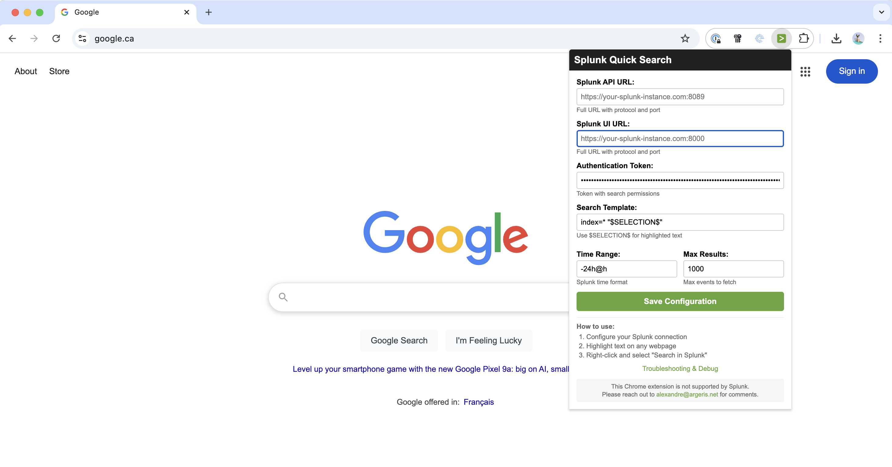
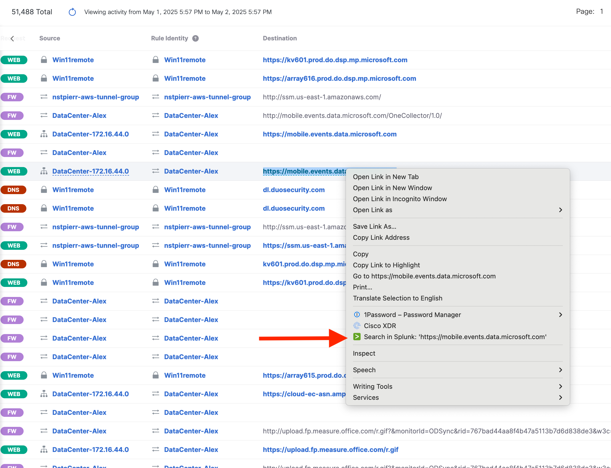
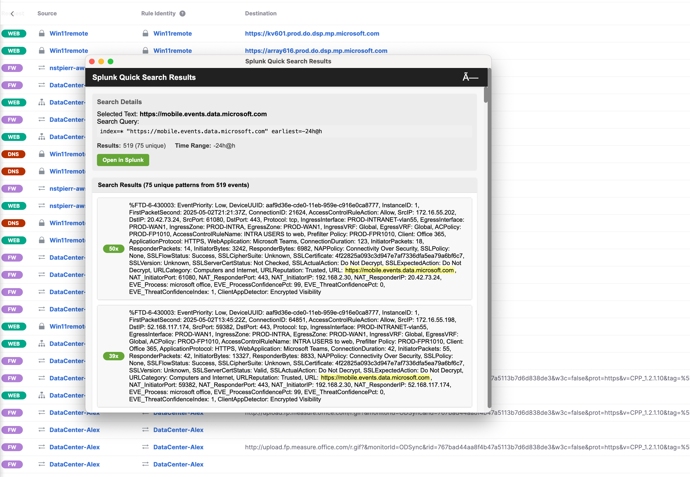

# Splunk Quick Search Chrome Extension

A Chrome extension that allows you to quickly search selected text in Splunk with a simple right-click.

## Features

- Right-click any selected text to search in Splunk
- Grouped results view with pattern detection and counts
- Token-based authentication for secure access
- Customizable search templates and time ranges
- Results displayed in a convenient popup window
- Built-in debug tools for troubleshooting

## Screenshots

### Configuration Interface

*Easy-to-use configuration interface for setting up your Splunk connection*

### Context Menu Integration

*Right-click on selected text to search in Splunk*

### Grouped Results View

*Smart grouping of similar log entries with occurrence counts*

## Installation

### Option 1: Load Unpacked Extension (Development)

1. Download the ZIP file and extract to a directory
2. Open Chrome and navigate to `chrome://extensions/`
3. Enable "Developer mode" in the top right corner
4. Click "Load unpacked"
5. Select the extension directory containing `manifest.json`


## Configuration

1. Click the extension icon in Chrome toolbar
2. Configure the following settings:
   - **Splunk API URL**: Your Splunk API endpoint (e.g., `https://splunk.company.com:8089`)
   - **Splunk UI URL**: Your Splunk web interface URL (e.g., `https://splunk.company.com:8000`)
   - **Authentication Token**: Your Splunk authentication token
   - **Search Template**: Search query template (default: `index=* $SELECTION$`)
   - **Time Range**: Time range for searches (default: `-24h@h`)
   - **Max Results**: Maximum number of results to fetch (default: 1000)

### Getting a Splunk Token

1. Log into your Splunk instance
2. Navigate to Settings → Tokens
3. Click "New Token"
4. Set appropriate permissions (search capability required)
5. Copy the token value (without any prefix)

## Usage

1. Select any text on a webpage
2. Right-click the selected text
3. Choose "Search in Splunk: 'your selected text'"
4. View results in the popup window

### Results View Features

- **Grouped Results**: Similar log entries are grouped with occurrence counts
- **Pattern Detection**: Automatically identifies and groups similar messages
- **Expandable Details**: Click on any group to see individual instances
- **Search Highlighting**: Your search terms are highlighted in yellow
- **Quick Stats**: View total results and unique patterns at a glance
- **Open in Splunk**: Click to open the full search in Splunk UI

## Example Workflow

1. **Select Text**: Highlight a URL, error message, or any text you want to search
2. **Right-Click**: Open the context menu
3. **Search**: Click "Search in Splunk: 'https://mobile.events.data.microsoft.com'"
4. **View Results**: See grouped results with pattern counts

## Troubleshooting

### Common Issues

1. **"Authentication failed" error**
   - Verify your token is correct
   - Ensure token has search permissions
   - Check if token has expired

2. **"Network error" or SSL certificate issues**
   - For self-signed certificates, visit your Splunk URL directly and accept the certificate
   - Try using HTTP instead of HTTPS for development environments
   - Verify the API URL is accessible from your network

3. **No results found**
   - Check your search template syntax
   - Verify the time range includes relevant data
   - Ensure your token has access to the searched indexes

### Debug Tools

1. Click "Troubleshooting & Debug" in the extension popup
2. Use the debug page to:
   - Test your Splunk connection
   - View stored configuration
   - Check for errors in the console

## File Structure

```
splunk-quick-search/
├── manifest.json          # Extension manifest
├── background.js          # Background service worker
├── content.js            # Content script
├── popup.html            # Configuration popup
├── popup.js              # Configuration logic
├── results.html          # Results display page
├── results.js            # Results handling and grouping
├── debug.html            # Debug interface
├── debug.js              # Debug functionality
├── images/               # Extension icons
│   ├── splunk-icon-16.png
│   ├── splunk-icon-48.png
│   └── splunk-icon-128.png
├── screenshots/          # Documentation images
│   ├── configuration.png
│   ├── context-menu.png
│   └── grouped-results.png
└── README.md             # This file
```

## Security Considerations

- Tokens are stored in Chrome's secure storage
- No sensitive data is logged to console
- All communications use HTTPS (when configured)
- No external dependencies or third-party libraries

## Limitations

- Maximum results limited to 50,000
- Pattern grouping may not catch all variations
- SSL certificate validation cannot be bypassed programmatically

## Support

This Chrome extension is not officially supported by Splunk.

For questions, issues, or feature requests, please contact:
**alexandre@argeris.net**

## License

This project is provided as-is without warranty. Feel free to modify and distribute according to your needs.

## Changelog

### Version 1.0
- Initial release
- Token-based authentication
- Grouped results view with pattern detection
- Customizable search templates
- Debug tools
- Context menu integration

---

**Note**: This extension requires a Splunk instance with API access enabled and a valid authentication token.
